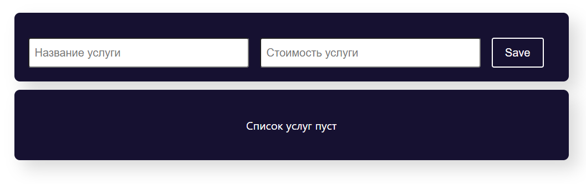
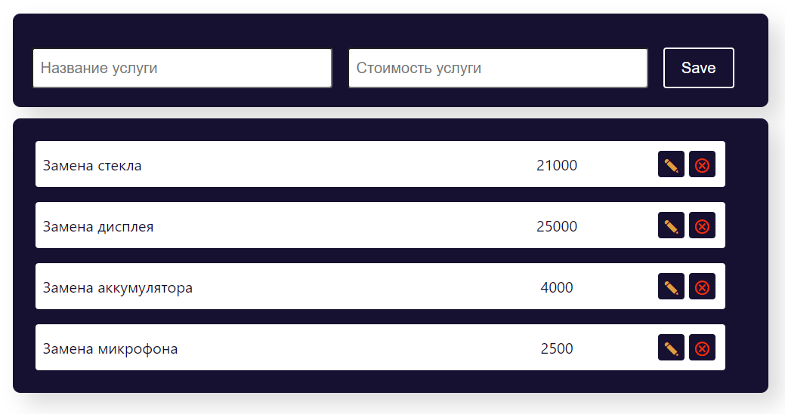
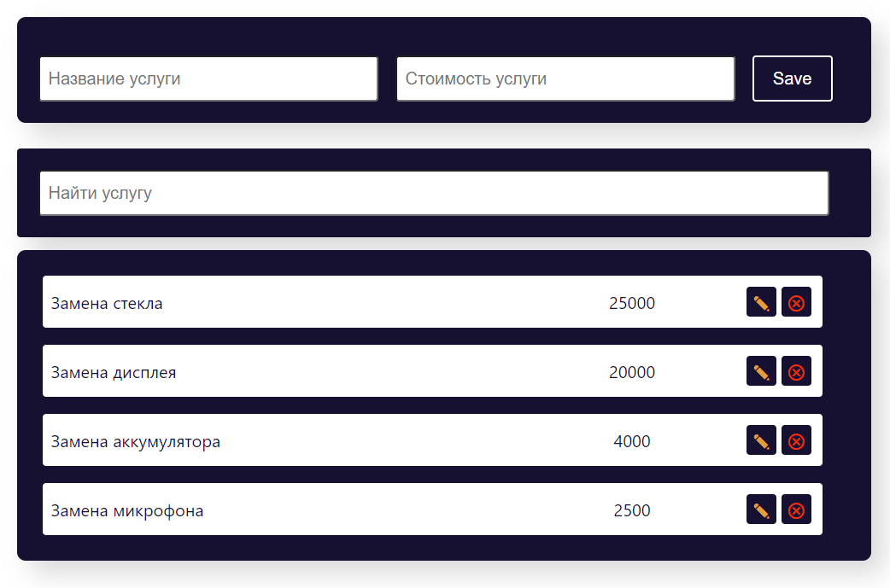
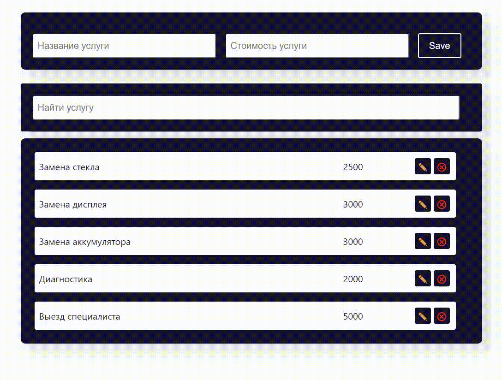

# Редактирование

Учебный проект курса [React для JS-разработчиков](https://netology.ru/programs/react)

## **Задача и описание реализации**

1. По умолчанию показывается форма добавления:

2. При заполнении и нажатии на кнопку Save происходит добавление элемента в список:

3. При нажатии на кнопку «Редактировать» форма автоматически заполняется данными элемента:

Далее возможны два сценария:

3.1 Если пользователь нажал на кнопку Save, запись в таблице обновляется.

3.2 Если пользователь нажал на кнопку Cancel, то поля вычищаются и снова отображается форма добавления.
## **Стек технологий**

## [**Демо**](https://editing-ruddy.vercel.app/)
