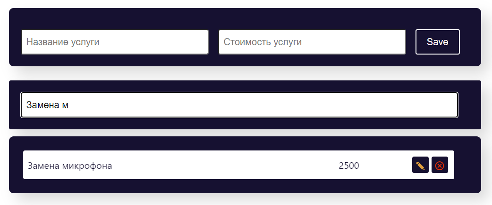
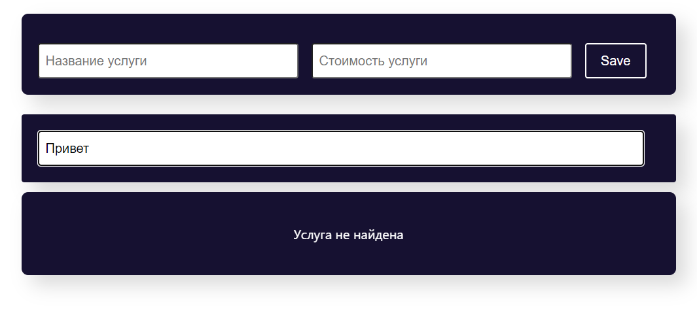

# Фильтрация

Учебный проект курса [React для JS-разработчиков](https://netology.ru/programs/react)

## **Задача и описание реализации**

Предложен вариант реализации возможности фильтрации: то есть есть строковое поле, при введении данных в которое отображаются только объекты, у которых название содержит введённую строку.

При пустом значении фильтра показываются все объекты:

Если значения нет в списке, выводится предупреждение:

Неважно, заполнен фильтр или нет, все функции редактирования — добавление, обновление, удаление — доступны.
## **Стек технологий**

## [**Демо**](https://filter-redux.vercel.app/)
